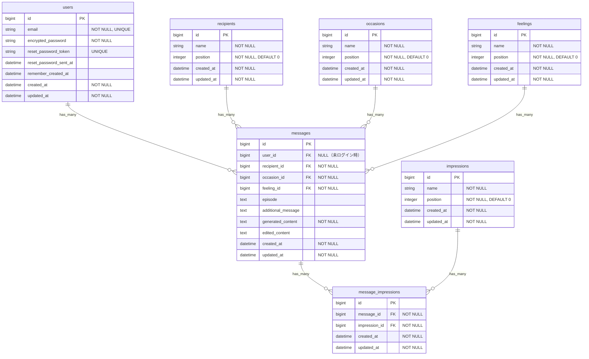

# ER図

KIMOCHI LETTERサービスのデータベース設計（Ruby on Rails 7 + Devise）

## ER図



## テーブル説明

### usersテーブル（Devise）

| カラム名 | 型 | 制約 | 説明 |
|---------|-----|------|------|
| id | bigint | PK | 主キー |
| email | string | NOT NULL, UNIQUE | メールアドレス |
| encrypted_password | string | NOT NULL | 暗号化パスワード |
| reset_password_token | string | UNIQUE | パスワードリセット用トークン |
| reset_password_sent_at | datetime | | リセットメール送信日時 |
| remember_created_at | datetime | | ログイン記憶日時 |
| created_at | datetime | NOT NULL | 作成日時 |
| updated_at | datetime | NOT NULL | 更新日時 |

### マスタテーブル

| テーブル名 | 説明 | 対応する質問 |
|-----------|------|-------------|
| recipients | 相手カテゴリ | ステップ1：誰にメッセージを届けたいですか？ |
| occasions | きっかけ | ステップ2：メッセージを届けたいと思ったきっかけは？ |
| impressions | 相手の印象 | ステップ3：その人はあなたにとってどんな存在ですか？（複数選択可） |
| feelings | 伝えたい気持ち | ステップ5：一番伝えたい気持ちはどれですか？ |

※ `position`カラムは`acts_as_list` gemまたは手動での並び順管理に使用

### messagesテーブル

| カラム名 | 型 | 制約 | 説明 |
|---------|-----|------|------|
| id | bigint | PK | 主キー |
| user_id | bigint | FK, NULL許可 | ユーザーID（未ログイン時はNULL） |
| recipient_id | bigint | FK, NOT NULL | 相手カテゴリID |
| occasion_id | bigint | FK, NOT NULL | きっかけID |
| feeling_id | bigint | FK, NOT NULL | 伝えたい気持ちID |
| episode | text | | ステップ4：思い出すエピソード |
| additional_message | text | | ステップ6：追加で伝えたいこと |
| generated_content | text | NOT NULL | 生成されたメッセージ |
| edited_content | text | | 編集後のメッセージ |
| created_at | datetime | NOT NULL | 作成日時 |
| updated_at | datetime | NOT NULL | 更新日時 |

### message_impressionsテーブル（中間テーブル）

| カラム名 | 型 | 制約 | 説明 |
|---------|-----|------|------|
| id | bigint | PK | 主キー |
| message_id | bigint | FK, NOT NULL | メッセージID |
| impression_id | bigint | FK, NOT NULL | 印象ID |
| created_at | datetime | NOT NULL | 作成日時 |
| updated_at | datetime | NOT NULL | 更新日時 |

※ `[message_id, impression_id]`の複合ユニーク制約を推奨

## Railsモデル関連

```ruby
# app/models/user.rb
class User < ApplicationRecord
  devise :database_authenticatable, :registerable,
         :recoverable, :rememberable, :validatable
  has_many :messages, dependent: :destroy
end

# app/models/message.rb
class Message < ApplicationRecord
  belongs_to :user, optional: true
  belongs_to :recipient
  belongs_to :occasion
  belongs_to :feeling
  has_many :message_impressions, dependent: :destroy
  has_many :impressions, through: :message_impressions
end

# app/models/recipient.rb
class Recipient < ApplicationRecord
  has_many :messages
end

# app/models/occasion.rb
class Occasion < ApplicationRecord
  has_many :messages
end

# app/models/feeling.rb
class Feeling < ApplicationRecord
  has_many :messages
end

# app/models/impression.rb
class Impression < ApplicationRecord
  has_many :message_impressions
  has_many :messages, through: :message_impressions
end

# app/models/message_impression.rb
class MessageImpression < ApplicationRecord
  belongs_to :message
  belongs_to :impression
end
```

## インデックス

```ruby
# db/migrate/xxx_add_indexes.rb
add_index :messages, :user_id
add_index :messages, :recipient_id
add_index :messages, :occasion_id
add_index :messages, :feeling_id
add_index :message_impressions, :message_id
add_index :message_impressions, :impression_id
add_index :message_impressions, [:message_id, :impression_id], unique: true
```

## 初期データ（シード）

### recipients（相手カテゴリ）
1. 親
2. パートナー
3. 友人
4. 兄弟・姉妹
5. 祖父母
6. 職場の人
7. その他

### occasions（きっかけ）
1. 誕生日・記念日
2. 日頃の感謝
3. 最近助けてもらった
4. しばらく会えていない
5. 特別な理由はない
6. その他

### impressions（相手の印象）
1. いつも支えてくれる
2. 一緒にいると安心する
3. 自分を理解してくれる
4. 困ったときに頼れる
5. 笑顔にしてくれる
6. 尊敬している
7. 刺激をもらえる

### feelings（伝えたい気持ち）
1. ありがとう
2. これからもよろしく
3. いつも助かっている
4. 大切に思っている
5. ごめんね、そしてありがとう
